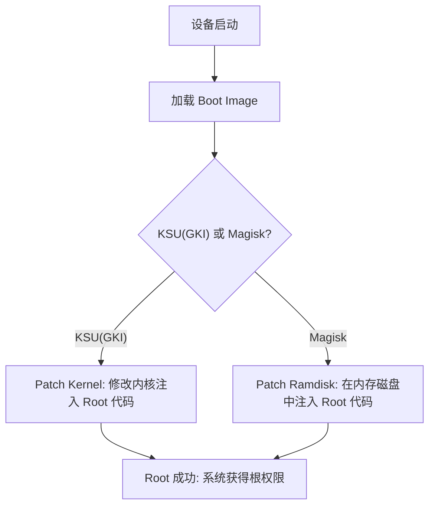
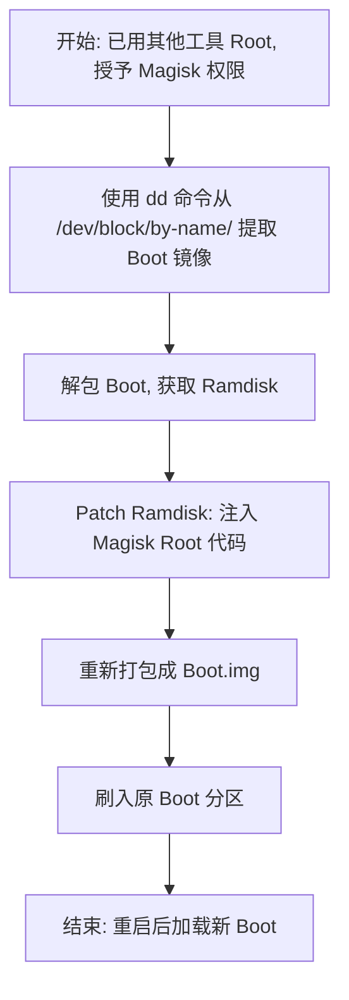
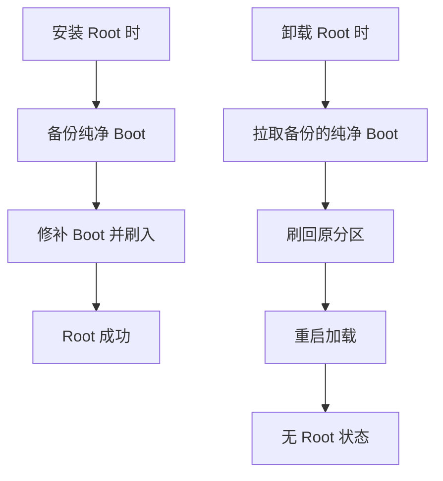
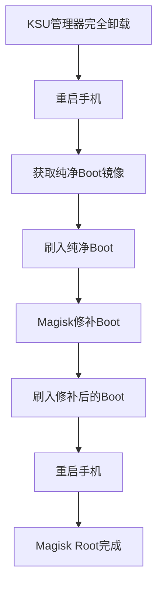

<!-- more -->

# 从 KSU(GKI) 切换到 Magisk Root 的正确方法

在 Android 设备上实现 Root（根权限）是许多高级用户常见的操作，它允许你获得系统的完全控制权，从而自定义设备。但不同 Root 工具的实现方式不同，如果切换不当，可能会导致设备崩溃、Bootloop（无限重启循环）甚至变砖。下面，我们先来了解 KSU(GKI) 和 Magisk 这两种常见 Root 工具的实现差异，以及为什么直接切换容易出错。然后，我会解释常见错误，并给出安全切换的详细步骤。

这些内容针对小白用户设计，我会尽量用简单易懂的语言解释技术术语，并在必要处添加额外说明，以帮助你更好地理解。如果你对某些概念不熟悉，别担心，我会逐步展开。

## KSU(GKI) 和 Magisk 的 Root 实现差异

Root 的核心是修改设备的启动镜像（Boot Image），以注入权限管理代码。但 KSU(GKI) 和 Magisk 的修改目标不同，这导致它们无法简单共存。

- **KSU(GKI)**: 通过 Patch（修补）Boot 分区中的 Kernel（内核）来实现 Root。Kernel 是操作系统的核心，负责管理硬件和软件资源。KSU 修改 Kernel，让它在启动时就加载 Root 权限。
  
- **Magisk**: 通过 Patch Boot 或 Init_Boot 分区中的 Ramdisk（内存磁盘）来实现 Root。Ramdisk 是一个临时的文件系统，在设备启动时加载，用于初始化系统。Magisk 在 Ramdisk 中注入代码，实现Systemless Root（此技术允许用户在不修改系统分区（/system）的情况下获得root权限。）。


**Tips**: 从 Android 13 开始，Google 改变了启动架构，将 Ramdisk 从传统的 Boot.img 中分离出来，单独存放在 Init_Boot.img 中。这就是为什么许多新手机需要修补 Init_Boot 而非 Boot 才能 Root。如果你用的是 Android 13 或更高版本的设备，请特别注意这个变化。


为了直观理解两种方式的差异，这里用一个简单的流程图展示：

这个图展示了启动过程中 Root 的注入点：KSU 针对 Kernel，Magisk 针对 Ramdisk。

## 常见错误：KSU(GKI) 模式下直接使用 Magisk 的“直接修补”

许多小白用户在 KSU(GKI) 已 Root 的情况下，直接授予 Magisk App Root 权限，然后使用 Magisk 自带的“直接修补”功能。这会导致两个 Root “共存”，但实际上它们无法兼容，最终系统崩溃。

**为什么会这样？** 因为两种工具修改了同一个 Boot 分区，但方式不同，导致冲突。严重的后果包括 Bootloop 或设备变砖（无法开机，需要“救砖”——恢复系统分区）。

我们需要先了解 Magisk 的“直接修补”是怎么工作的。我们可以解包 Magisk.apk（Magisk 的安装包），分析里面的 assets/boot_patch.sh 文件。这个 Sh 脚本负责对 Boot 进行 Patch。

忽略此sh脚本三星手机的特殊 Kernel 修改，Magisk “直接修补”的流程大致如下（假设你已用其他工具如 KSU Root，并授予 Magisk 权限）：

1. 通过 Root 权限，使用 `dd` 命令从 `/dev/block/by-name/`（块设备符号链接目录）中提取 Boot 镜像。这是一个系统目录，存放设备分区的链接。
2. 解包提取的 Boot，得到 Ramdisk。
3. Patch 这个 Ramdisk：修改它，注入 Magisk 的 Root 代码。
4. 修改后，重新打包成 Boot.img。
5. 自动刷入原 Boot 分区。

这里用 Mermaid 流程图更清晰地展示这个过程：

**问题出在哪里？** 如果你已用 KSU(GKI) Root，那么 Boot 分区已被 KSU 修改过（Kernel 已 Patch）。Magisk 从块设备提取的 Boot 不是原厂的，而是已被 KSU 改动的版本。然后 Magisk 再对它的 Ramdisk 进行 Patch，导致 Boot 被“双重修改”：Kernel（KSU）+ Ramdisk（Magisk）。重启后，两个 Root 实现互相冲突，系统就“爆炸”了。

这就是为什么在 KSU(GKI) 下，不能直接用 Magisk 的“直接修补”来切换 Root。

## 为什么不能用 Root 管理器的“卸载”功能解决冲突？

有些用户想：“冲突了就卸载其中一个不就好了？”这是一个好问题，但实际情况更复杂。Root 管理器的“卸载”功能不是简单删除修改，而是恢复到无 Root 状态，这会让你从头开始。

**Root 管理器卸载的原理**
先回顾 Root 的安装过程：

1. 解锁 Bootloader（引导加载器锁）：这是 Root 的前提，允许修改系统分区。
2. 获取当前系统版本对应的纯净 Boot 镜像。方式包括：

* 通过深度刷机模式提取，例如高通的 EDL（Emergency Download Mode，紧急下载模式，也叫 9008 模式）；联发科的 BROM（Boot Read-Only Memory，引导只读存储器）。**注意**：如果设备已 Root，绝对不要用这种方式提取 Boot，因为提取出的已是修改版。
* 通过第三方社区人员直接分享的纯净boot、从官方提供的ROM包中，提取出纯净的boot分区。

3. 将纯净 Boot 交给 Root 管理器修补，修补后刷回原分区，重启加载新 Boot，即 Root 成功。

**卸载时，管理器是怎么做的？**
首先我们要了解：
Root管理器在首次修补 Boot 时，会备份纯净（未修改）的 Boot。卸载功能就是拉取这个备份，刷回原分区，重启。


**Tips**: 不同管理器的备份位置不同。例如，Magisk 用 SHA1 哈希命名，位于 `/data/magisk_backup_<SHA1>/`。备份在首次安装、修复环境或修补新镜像时自动创建。


KSU 的卸载也类似：拉取备份的纯净 Boot，刷回分区，重启。

所以，如果两个 Root “共存”（实际是冲突），用其中一个的卸载功能，会直接恢复到无 Root 状态。你不仅没切换成功，还得从头来过，更麻烦。

这里用流程图展示卸载原理：

## 如何安全从 KSU(GKI) 切换到 Magisk？

核心思路是“彻底归零，重新开始”：先完全卸载 KSU，恢复无 Root 状态，然后用纯净 Boot 让 Magisk 修补。

**详细步骤**（强烈推荐这个最安全的方法，无论如何都别省略）：

1. 打开 KSU 管理器，选择“卸载”功能。在弹窗中，必须选“完全卸载”！（不是“还原原厂映像”，后者可能不彻底）。
2. 卸载后，重启手机。此时设备应无 Root（已“归零”）。
3. 获取当前系统版本的纯净（未修改）Boot 镜像。方式如上所述：从官方ROM、深刷模式回读，**确保版本匹配**。
4. 将设备进入Fastboot或其他刷机模式，刷入纯净的boot.img镜像文件、重启手机。（彻底“归零”）此时设备应就没有任何root的残留、痕迹、文件了。
5. 用 Magisk App 修补这个纯净 Boot，得到 magisk_patched_boot.img（或类似名称）。
6. 再次将设备进入刷机模式、将修补后的 Boot 刷回原分区。可以用 Fastboot 命令、深度刷机模式等工具。
7. 刷入后，重启手机，加载 Magisk 修补的 Boot。
8. 完成！现在你的 Root 由 Magisk 管理。

这里用 Mermaid 流程图总结切换步骤，便于小白跟随：

这个方法避免了冲突，确保安全。如果你严格按步骤操作，风险最小。不过我仍建议你在正式开始操作前，提前备份数据、系统分区。如果遇到问题，请在论坛求助具体机型指南。